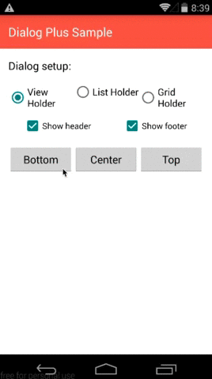
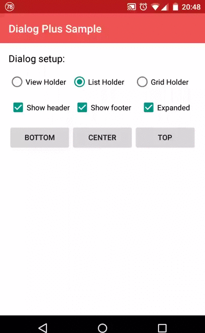

# DialogPlus

DialogPlus displays customizable dialogs inside an Android Activity. Use a list,
a grid, or your own layout, with animated placement at the top, center, or bottom.

- ListView and GridView content backed by a `BaseAdapter`.
- Custom content from a layout resource or an existing `View`.
- Optional headers and footers, click callbacks, and cancellation callbacks.
- Expandable list and grid dialogs with drag gestures.
- Custom animations, dimensions, margins, padding, and backgrounds.

 

## Installation

The available Maven Central release is **1.11**:

```kotlin
repositories {
    mavenCentral()
}

dependencies {
    implementation("com.orhanobut:dialogplus:1.11")
}
```

Use the ordinary Maven dependency declaration so Gradle includes its dependency
metadata. The examples below use APIs available in 1.11.

## Quick start

Create and show dialogs from an Activity on the UI thread:

```kotlin
val adapter = ArrayAdapter(
    this,
    android.R.layout.simple_list_item_1,
    listOf("Share", "Save", "Open"),
)

val dialog = DialogPlus.newDialog(this)
    .setAdapter(adapter)
    .setOnItemClickListener { dialog, item, _, _ ->
        Toast.makeText(this, item.toString(), Toast.LENGTH_SHORT).show()
        dialog.dismiss()
    }
    .create()

dialog.show()
```

Import `com.orhanobut.dialogplus.DialogPlus`, `android.widget.ArrayAdapter`, and
`android.widget.Toast`. The default content holder is `ListHolder`; list and grid
holders need an adapter to display items.

## Content and placement

```kotlin
// A list is the default.
.setContentHolder(ListHolder())

// A grid with three columns.
.setContentHolder(GridHolder(3))

// A custom layout, or use ViewHolder(existingView).
.setContentHolder(ViewHolder(R.layout.dialog_content))

// Gravity.BOTTOM is the default. TOP and CENTER are also supported.
.setGravity(Gravity.CENTER)
```

Import holders from `com.orhanobut.dialogplus` and gravity from `android.view`.
`ViewHolder` does not need an adapter. Access the inflated content through
`dialog.holderView`, or find a child with `dialog.findViewById(R.id.your_view)`.

## Configuration

Builder calls can be chained before `create()`:

```kotlin
.setHeader(R.layout.dialog_header) // Also accepts a View.
.setFooter(R.layout.dialog_footer) // Also accepts a View.
.setExpanded(true, 300)            // List and grid only; initial height in pixels.
.setContentWidth(ViewGroup.LayoutParams.MATCH_PARENT)
.setContentHeight(ViewGroup.LayoutParams.WRAP_CONTENT)
.setMargin(16, 24, 16, 24)
.setPadding(8, 8, 8, 8)
.setOutMostMargin(0, 0, 0, 0)
.setContentBackgroundResource(android.R.color.white)
.setOverlayBackgroundResource(android.R.color.transparent)
.setInAnimation(R.anim.dialog_enter)
.setOutAnimation(R.anim.dialog_exit)
.setCancelable(true)
```

Dimensions, margins, and padding are **pixels**, not dp. Convert dp using display
density when needed. Expansion is disabled by default; `setExpanded(true)` uses
an initial height of two fifths of the available display height. Centered dialogs
receive default margins unless you explicitly set them.

`dialog.headerView` and `dialog.footerView` return the configured views or null.
For custom content, headers, and footers, `setOnClickListener` receives clicks on
views with an ID. List and grid rows use `setOnItemClickListener`; list item
positions exclude the scrolling header.

```kotlin
.setOnClickListener { _, view ->
    when (view.id) {
        R.id.confirm -> confirmSelection()
    }
}
.setOnCancelListener { /* Back button or outside touch cancellation. */ }
.setOnDismissListener { /* Exit animation has completed. */ }
.setOnBackPressListener { /* Legacy back key was received. */ }
```

Cancelable dialogs close on an outside touch or back key. `setCancelable(false)`
disables automatic cancellation; `dismiss()` still closes the dialog.

## Activity integration

Release 1.11 supports Android API 10 and later. It attaches to the Activity's
content view, so pass an Activity context and keep dialog operations on the UI
thread. Retain the dialog in the Activity and dismiss it when that Activity is
destroyed. Avoid retaining it across configuration changes.

The published release uses legacy back-key handling. Apps using predictive back
or another back-navigation dispatcher should route their dialog back action to
`dialog.onBackPressed(dialog)` and leave the app's normal back action active when
the dialog is hidden. When using an edge-to-edge Activity, apply system-bar insets
to the hosting content so controls and dialogs stay clear of system UI.

## License

[Apache License 2.0](LICENSE).
